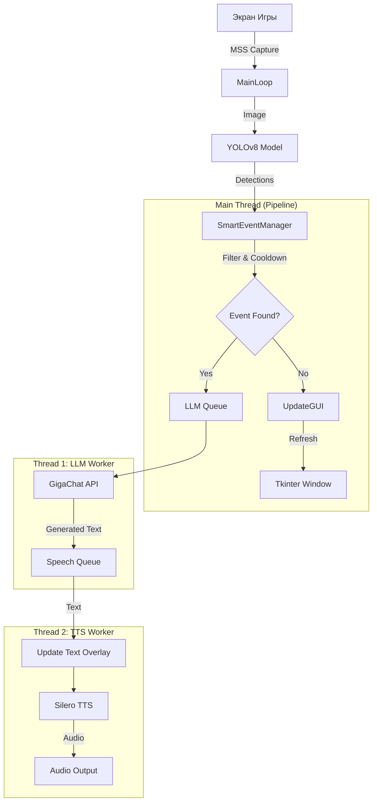

**AI Commentator** — это приложение реального времени, предназначенное для автоматического комментирования игрового процесса Valorant. Система захватывает изображение с экрана, распознает игровые события с помощью нейросети YOLOv8, генерирует контекстные комментарии через LLM (GigaChat) и озвучивает их с помощью синтеза речи (Silero TTS).

Архитектура приложения построена на **инверсии управления (Inversion of Control)**: классы выполняют роль инструментов, а основной цикл управления (Event Loop) и бизнес-логика реализованы процедурно в точке входа `__main__`.

---

### КАК ОНО ЗАПУСКАЕТЬСЯ
#### Шаг 1.
Скачайте репозиторий
#### Шаг 2.
!!! У вас есть 2 папки(resources и models)  
!!! В resources нужные зависимости для приложения, а в models нужные веса для моделей tts и cv  
**запускется приложение с помощью start.bat**
#### Шаг 3.
Выполните инструкции которые показывает консоль до надписи "VALCOMMS ГОТОВА К РАБОТЕ!"
#### Шаг 4.
Программа в реальном времени смотрит на экран и комментирует всё что связанно с Valorant(как игру, так и видео на экране)

---

## Стек технологий
*   **Язык:** Python 3.10+
*   **Компьютерное зрение (CV):** Ultralytics YOLOv8 (Inference), OpenCV (Image processing).
*   **Захват экрана:** MSS (Fast screen capture).
*   **GUI:** Tkinter (Overlay, прозрачность).
*   **NLP / LLM:** GigaChat API (SberDevices).
*   **TTS (Text-to-Speech):** Silero Models (Torch), SoundDevice (Audio playback), Librosa (Audio effects).
*   **Многопоточность:** `threading`, `queue`.

---

## Конфигурация и Константы
Основные параметры, влияющие на поведение системы:

*   **`HISTORY_LENGTH` (int):** Размер скользящего окна (количество кадров) для анализа стабильности события.
*   **`ACTIVATION_THRESHOLD` (int):** Минимальное количество обнаружений события внутри окна истории для его подтверждения (защита от "мерцания").
*   **`GLOBAL_COOLDOWN` (float):** Глобальная задержка между любыми фразами (в секундах).
*   **`EVENT_COOLDOWNS` (dict):** Индивидуальные таймеры для конкретных событий (например, бомба — 15 сек, враг — 8 сек).
*   **`CONFIDENCE_THRESHOLD` (float):** Порог уверенности нейросети YOLO (0.0 - 1.0).

---

## Описание Классов

### 1. Класс `SmartEventManager`
Отвечает за логику фильтрации событий, подавление шума и контроль частоты оповещений.

**Методы:**
*   `__init__()`: Инициализирует очередь истории (`deque`) и словари таймеров.
*   `analyze(detected_classes_set: set) -> (str | None, str | None)`:
    *   **Вход:** Множество строк (названия классов), обнаруженных на текущем кадре.
    *   **Логика:**
        1.  Добавляет кадр в историю.
        2.  Выполняет голосование (Voting): событие считается валидным, только если оно встречается >= `ACTIVATION_THRESHOLD` раз.
        3.  Выбирает *приоритетное* событие (Бомба > Убийство > Враг).
        4.  Проверяет глобальный и индивидуальный кулдауны.
    *   **Выход:** Кортеж `(event_id, color_hex)` или `(None, None)`.

### 2. Класс `ValorantOverlay`
Отвечает за визуальную составляющую (прозрачное окно) и захват изображения. Не содержит собственного цикла `mainloop`, управляется извне.

**Методы:**
*   `__init__()`:
    *   Создает окно `tk.Tk`.
    *   Устанавливает флаги: `-topmost` (поверх окон), `-transparentcolor` (прозрачность фона), `-overrideredirect` (без рамок).
    *   Инициализирует захват экрана через `mss`.
*   `get_screen_image() -> np.array`:
    *   Захватывает область монитора.
    *   Конвертирует `BGRA` (mss) в `BGR` (OpenCV/YOLO).
*   `set_text(text: str, color: str)`: Обновляет текст и цвет метки на экране.
*   `update_gui()`:
    *   Вызывает `root.update_idletasks()` и `root.update()`.
    *   **Важно:** Этот метод должен вызываться в каждом цикле основного пайплайна для предотвращения зависания интерфейса.

---

## Вспомогательные функции (Workers)
Функции, работающие в отдельных потоках (`daemon threads`), для выполнения тяжелых I/O операций без блокировки основного цикла CV.

### 1. `llm_worker(llm_queue, speech_queue, gui_ref)`
Поток генерации текста.
1.  Ожидает `event_id` из очереди `llm_queue`.
2.  Формирует промпт на основе описания события.
3.  Отправляет синхронный запрос к API GigaChat (`generate_text`).
4.  Очищает полученный ответ от спецсимволов.
5.  Помещает результат в очередь `speech_queue`.

### 2. `tts_worker(speech_queue, tts_model, gui_queue)`
Поток синтеза и воспроизведения речи.
1.  Ожидает текст из очереди `speech_queue`.
2.  Отправляет данные `(текст, цвет)` в очередь `gui_queue`, чтобы главный поток безопасно обновил интерфейс.
3.  Генерирует аудио-тензор через модель Silero.
4.  *(Опционально)* Применяет питч-шифтинг (аниме-голос) через `librosa`.
5.  Воспроизводит звук через `sd.play()` и блокирует поток до завершения (`sd.wait()`).
6.  Отправляет команду очистки текста в `gui_queue` после паузы.

---

## Пайплайн запуска и работы (Runtime Pipeline)

Основная логика реализована в блоке `if __name__ == "__main__":`. Процесс разделен на этапы инициализации и бесконечного цикла.

### Этап 1: Инициализация (Bootstrap)
1.  **Инстанцирование:** Создание объектов `ValorantOverlay` и `SmartEventManager`.
2.  **Очереди:** Создание `queue.Queue` для асинхронной связи (`llm_queue`, `speech_queue`).
3.  **Загрузка моделей:**
    *   Загрузка весов YOLO (`my_yolo.pt`).
    *   Загрузка/скачивание модели Silero TTS (`tts_model.pt`).
4.  **Запуск потоков:** Инициализация и старт `llm_worker` и `tts_worker` в режиме демонов.

### Этап 2: Главный цикл (Main Loop)
Цикл `while True` выполняется с максимальной частотой (ограниченной скоростью работы YOLO и `mss`).

1.  **Capture (Захват):**
    *   Вызов `overlay.get_screen_image()`. Получение матрицы пикселей.
2.  **Inference (Распознавание):**
    *   Передача изображения в `yolo_model`.
    *   Фильтрация результатов по `CONFIDENCE_THRESHOLD`.
3.  **Extraction (Извлечение):**
    *   Преобразование индексов классов (`cls_id`) в строковые имена (`names`). Формирование множества (`set`) обнаруженных объектов.
4.  **Analysis (Анализ):**
    *   Передача множества в `manager.analyze()`.
    *   Менеджер обновляет историю, проводит голосование и проверяет таймеры.
    *   Возвращает `event_id` (если событие подтверждено) или `None`.
5.  **Dispatch (Распределение):**
    *   Если событие подтверждено (`event_id` не None):
    *   Проверка заполненности очереди LLM (`qsize == 0`). Если свободно — событие отправляется на генерацию текста.
    *   На оверлее отображается статус "⚡ AI Думает...".
6.  **GUI Refresh (Отрисовка):**
    *   Вызов `overlay.update_gui()`. Обработка событий окна Windows (перерисовка, перемещение).

---

## Схема потоков данных

## Список используемых библиотек в проекте

*  ultralytics
*  mss
*  opencv-python
*  numpy<2
*  torch
*  sounddevice
*  librosa
*  requests
*  urllib3